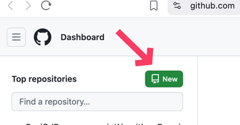
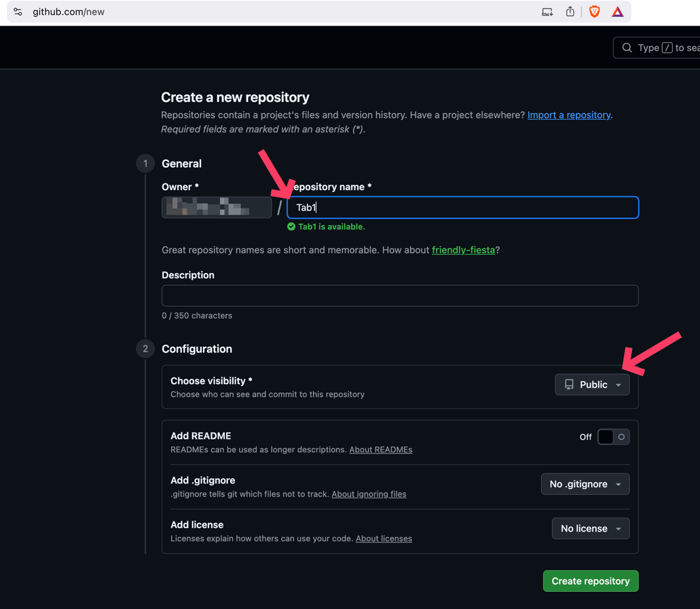
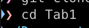
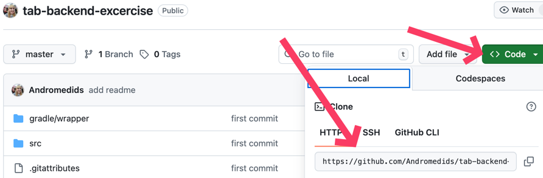
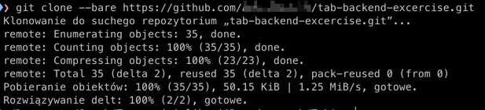
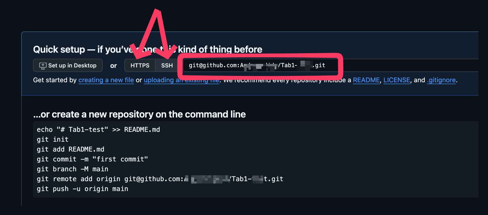
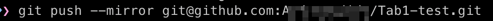
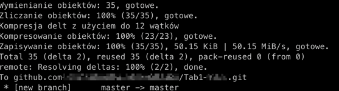

# Instrukcja

## "Cichy fork"
Każdy Student, bardzo proszę, niech pracuje na własnej kopii repozytorium, czyli właśnie na swoim forku.
W dodatku będzie on "cichy" czyli nie będzie można widzieć, że Państwo to forkowali ode mnie i nie będzie spojlerowania funu.

W tym celu bardzo proszę wykonywać poniższe kroki:
1. Proszę na Githubie stworzyć nowe repozytorium, np o nazwie `Tab1`
    
    
2. Proszę otworzyć `git basha` /`terminal` (w zależności od systemy operacyjnego) i poleceniami `cd` proszę przejsć do folderu, gdzie chcą mieć Państwo ten projekt
3. Proszę utworzyć nowy folder dla projektu `mkdir Tab1` i proszę wejść do tego folderu.
   
    
4. A następnie proszę skopiować adres tego repozytorium:
    
5. W terminalu lub `git bashu` proszę wpisać polecenie: `git clone --bare <url>` a zamiast `<url>` wklej skopiowany link.
    
6. Proszę zrobić `ls -al` i następnie proszę wejść do katalogu, który się utworzył
    
7. Na Githubie, w tym repozytorium, które Państwo utworzyli w kroku 1wszym, proszę skopiować adres repozytorium, który się podpowiada (ssh lub https, w zależności co Państwo macie skonfigurowane)
    
8. A następnie w terminalu / `git bashu` wpisać polecenie `git push --mirror <url>`, gdzie zamiast `<url>` wklejacie Państwo skopiowany link w punkcie poprzednim.
    
    
9. Proszę przejsć do katalogu wyżej (`cd ..`)  
10. I następnie wpisać polecenie `rm -rf <nazwa tego folderu>`
    
11. Następnie proszę odświeżyć stronę na Githubie, odnaleźć link do Państwa repozytorium (zielony guzik `code`), skopiować go i sklonować już Państwa cichego forka do siebie używając polecenia `git clone <url>` gdzie za `<ul>` wkleją Państwo link
    
12. Teraz wystarczy otworzyć projekt w IntelliJu, poprzez `File -> New -> Project from Existing Sources` wybrać lokalizację projektu, wybrać plik `build.gradle` i otworzyć

Można przejść do implementacji zadania wysłanego inną drogą.